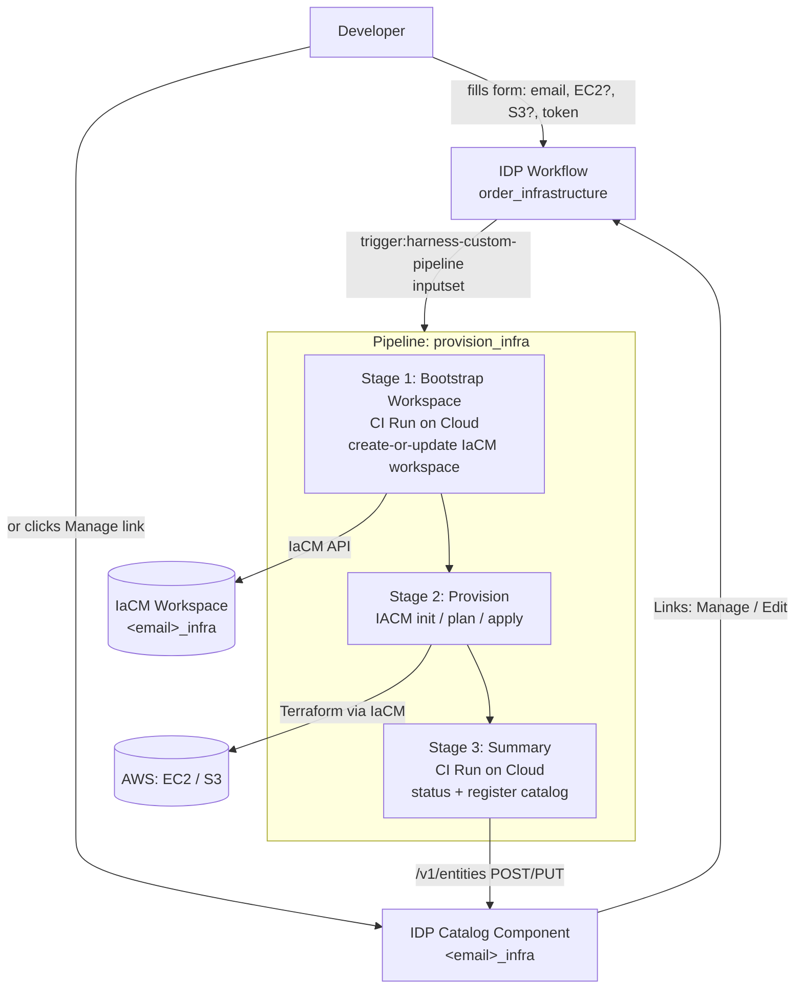

# IDP + IaCM Self-Service Infrastructure — Implementation Guide

End-to-end design and operations doc for the self-service AWS provisioning system built
on **Harness IDP** (Internal Developer Portal) and **Harness IaCM** (Infrastructure as
Code Management).

A developer fills a short IDP form (email + EC2/S3 checkboxes), which triggers a Harness
pipeline. The pipeline creates/reuses a **single IaCM workspace per user**, runs
Terraform to reconcile the requested resources, and publishes a **catalog entry per user**
that doubles as a manageable "table" of provisioned infrastructure.

---

## 1. Goals & model

| Goal | How it's met |
|---|---|
| Self-service provisioning | IDP Workflow form → triggers `provision_infra` pipeline |
| One workspace per user (not per resource) | Workspace id = `<email>_infra`, created/reused by the pipeline |
| Multiple resources per user | Terraform modules gated by `create_ec2` / `create_s3` booleans |
| Declarative add **and** remove | Checking a box creates a resource; unchecking it on a re-run destroys it (`count = 0`) |
| No delegate required | API/bootstrap steps run as **CI `Run` steps on Harness Cloud** |
| Visible "table" of who has what | Pipeline upserts an **IDP catalog Component** per user, tagged with the resources that exist |
| Manage from the table | Each catalog row links to the workflow **pre-filled** with the user's current state |

### Declarative reconciliation

The desired state is the checkbox selection. Because each module uses
`count = var.create_* ? 1 : 0`, a single `terraform apply` converges to exactly what was
selected:

| `create_ec2` | `create_s3` | Result of apply |
|---|---|---|
| true | false | EC2 present, S3 absent |
| false | true | S3 present, EC2 absent |
| true | true | Both present |
| false | false | Both destroyed |

---

## 2. Architecture



### Resource inventory (Harness)

| Resource | Identifier | Scope |
|---|---|---|
| Account | `aBh2PBI0T1CYMmA6iQFosg` | — |
| Org | `default` | — |
| Project | `IDP_POC` | org `default` |
| Pipeline | `provision_infra` | project `IDP_POC` |
| IDP Workflow | `order_infrastructure` | account |
| IDP Group (owner) | `platform_team` | account |
| AWS Connector | `aws_connector` | (referenced by workspace) |
| GitHub Connector | `github_connector` | (referenced by workspace) |
| Secret: Harness API key | `harness_api_key` | used by Run steps |
| Secret: AWS session token | `AWS_SESSION_TOKEN` | injected into workspace env |
| Secrets: AWS creds | `AWS_ACCESS_KEY_ID`, `AWS_SECRET_ACCESS_KEY` | used by `aws_connector` |
| Git repo | `idp-iacm-poc` (GitHub: `kartikkaushik27`) | Terraform source |
| Catalog component (per user) | `<email>_infra` (e.g. `kartik_kaushik_harness_io_infra`) | project `IDP_POC` |

---

## 3. Repository layout (Terraform)

```
.
├── provider.tf            # AWS + random providers (creds injected by IaCM connector)
├── variables.tf           # root inputs: create_ec2, create_s3, owner_email, owner_name, region, instance_type
├── main.tf                # conditional ec2 / s3 modules (count-gated)
├── outputs.tf             # surfaced as IaCM apply output variables
├── modules/
│   ├── ec2/main.tf        # Amazon Linux 2 instance (AMI via data source)
│   └── s3/main.tf         # globally-unique bucket (random suffix)
├── workflow.yaml          # IDP Workflow (Backstage scaffolder format)
├── workflow_harness.yaml  # IDP Workflow (harness.io/v1 native format, used for API registration)
├── group_platform_team.yaml  # IDP Group entity (workflow/catalog owner)
├── harness/
│   └── provision_infra.pipeline.yaml  # the pipeline (source of truth, INLINE in Harness)
└── docs/
    └── IMPLEMENTATION.md  # this file
```

### Root variables (`variables.tf`)

| Variable | Type | Default | Purpose |
|---|---|---|---|
| `create_ec2` | bool | `false` | Provision an EC2 instance; `false` removes it |
| `create_s3` | bool | `false` | Provision an S3 bucket; `false` removes it |
| `owner_email` | string | (required) | Tagging + workspace/bucket naming |
| `owner_name` | string | `""` | Display name tag |
| `region` | string | `us-east-1` | AWS region |
| `instance_type` | string | `t2.micro` | EC2 size |

### Conditional modules (`main.tf`)

```terraform
module "ec2" {
  source        = "./modules/ec2"
  count         = var.create_ec2 ? 1 : 0
  owner_email   = var.owner_email
  owner_name    = var.owner_name
  instance_type = var.instance_type
}

module "s3" {
  source      = "./modules/s3"
  count       = var.create_s3 ? 1 : 0
  owner_email = var.owner_email
  owner_name  = var.owner_name
}
```

Outputs use `try(module.x[0]..., "")` so they resolve to empty strings when a module is
not instantiated.

---

## 4. IDP Workflow (`order_infrastructure`)

The user-facing form. Two equivalent representations exist:
- `workflow.yaml` — Backstage `scaffolder.backstage.io/v1beta3` format.
- `workflow_harness.yaml` — `harness.io/v1` native format (this is what gets registered via the entities API).

Form fields: **email**, **name**, **createEc2** (checkbox), **createS3** (checkbox),
**token** (Harness auth).

Key part — the `inputset` that maps form values to pipeline variables:

```yaml
inputset:
  workspace_id: ${{ parameters.email | replace("@", "_") | replace(".", "_") }}_infra
  requester_email: ${{ parameters.email }}
  requester_name: ${{ parameters.name }}
  create_ec2: ${{ parameters.createEc2 | string }}
  create_s3: ${{ parameters.createS3 | string }}
apikey: ${{ parameters.token }}
```

> **Critical:** the `| string` filter on `createEc2` / `createS3` is required. The pipeline
> variables `create_ec2` / `create_s3` are typed **String**, but a checkbox emits a JSON
> boolean. Without `| string`, the trigger fails with:
> `Invalid yaml: $.pipeline.variables[...].value: boolean found, string expected`.

The `workspace_id` is the user's email with `@` and `.` replaced by `_`, suffixed with
`_infra` — e.g. `kartik.kaushik@harness.io` → `kartik_kaushik_harness_io_infra`.

---

## 5. Pipeline (`provision_infra`)

Source of truth: `harness/provision_infra.pipeline.yaml` (stored INLINE in Harness).

### Pipeline variables

| Variable | Type | Source |
|---|---|---|
| `workspace_id` | String | `<email>_infra` from the workflow |
| `requester_email` | String | form email |
| `requester_name` | String | form name |
| `create_ec2` | String | `"true"` / `"false"` |
| `create_s3` | String | `"true"` / `"false"` |

### Stage 1 — Bootstrap Workspace (CI `Run` on Harness Cloud)

Creates the IaCM workspace if missing, or updates it if present (create-or-reuse). Runs on
Harness Cloud (no delegate) and uses `curl` against the IaCM API.

What it does:
1. `GET` the workspace by id.
2. If `200` → `PUT` to update; otherwise `POST` to create.
3. The workspace body wires up the connectors and variables:
   - `provider_connector: aws_connector`, `repository_connector: github_connector`,
     `repository: idp-iacm-poc`, `repository_path: .`, branch `main`.
   - `terraform_variables`: `create_ec2`, `create_s3`, `owner_email`, `owner_name`.
   - `environment_variables`: **`AWS_SESSION_TOKEN`** as a `secret` env var.

> **Why `AWS_SESSION_TOKEN` is injected:** the requester uses AWS STS **temporary
> credentials**. The `aws_connector` supplies the access key + secret, but not the session
> token, so it's added as a workspace environment variable referencing the
> `AWS_SESSION_TOKEN` secret. Without it, Terraform auth fails.

### Stage 2 — Provision (IACM)

Runs the IaCM Terraform plugin against `<+pipeline.variables.workspace_id>` on Harness Cloud:
`init` → `plan` → `apply`. This is what actually reconciles AWS to the desired state
(creating checked resources and destroying unchecked ones).

### Stage 3 — Summary (CI `Run` on Harness Cloud)

Two steps:
1. **Workspace Status** — prints the final workspace JSON.
2. **Register Catalog Entity** — upserts the per-user IDP catalog Component (see §6).

---

## 6. The catalog "table" (Register Catalog Entity step)

This is the feature that turns the catalog into a per-user table of provisioned infra.

### How it works

A non-blocking `python3` step (stdlib only — no `jq`) builds a `harness.io/v1` **Component**
YAML and upserts it via the entities API:

- **Create:** `POST /v1/entities?orgIdentifier=default&projectIdentifier=IDP_POC` with body `{"yaml": "..."}`.
- **Update (on later runs):** `PUT /v1/entities/account.default.IDP_POC/component/<id>?orgIdentifier=default&projectIdentifier=IDP_POC`.

The step tries `POST` first; if the component already exists it falls back to `PUT` to
refresh tags/links/annotations.

> **Why create-then-update?** Despite the API docs describing `PUT` as
> "idempotent, creates if missing", in practice `PUT` on a non-existent project component
> returns `400 ... Entity ... not found`. So creation must go through `POST`.

### Component shape

```yaml
apiVersion: harness.io/v1
kind: Component
identifier: <email>_infra
name: <email>_infra
orgIdentifier: default
projectIdentifier: IDP_POC
type: infrastructure
owner: group:account/platform_team
spec:
  lifecycle: production
metadata:
  description: AWS infra managed via IDP for <email>
  links:
    - title: Manage / Edit Resources
      url: <prefilled workflow URL>
    - title: IaCM Workspace
      url: <workspace URL>
  annotations:
    idp-iacm/owner-email: "<email>"
    idp-iacm/ec2: "true|false"
    idp-iacm/s3: "true|false"
  tags:
    - idp-iacm-infra        # constant tag → use as the table filter
    - ec2                   # present only if EC2 exists
    - s3                    # present only if S3 exists
```

### Viewing the table

Harness → **IDP → Catalog**, filter by kind `Component` and/or tag `idp-iacm-infra`
(save it as a view). Each row is a user's infra; the **tags** column shows what they
currently have; **owner** is `platform_team`.

### Non-blocking guarantee

The step can never fail provisioning:
- The whole `python3` invocation is guarded with `|| echo "...non-blocking"` (covers a
  missing interpreter).
- The script always ends with `sys.exit(0)`, printing `Catalog upsert failed (non-blocking)`
  if the API call did not return 2xx.

So a catalog/API hiccup leaves AWS provisioning unaffected.

---

## 7. Manage / trigger from the catalog

Catalog entities don't have a native "Run pipeline" button — the supported pattern is a
**link** on the entity that launches the workflow.

### From a user's row (carries current state)

1. **IDP → Catalog** → open the user's component (e.g. `kartik_kaushik_harness_io_infra`).
2. Right sidebar → **Links** → **Manage / Edit Resources**.
3. The `Order Infrastructure` workflow opens **pre-filled** with email + current EC2/S3
   checkboxes via the `?formData=` URL param.
4. Toggle resources, paste token, **Submit** → pipeline reconciles → catalog row refreshes.

The prefill URL format (URL-encoded JSON):

```
https://app.harness.io/ng/account/<acct>/module/idp/create/templates/default/order_infrastructure?formData=%7B%22email%22%3A%22<email>%22%2C%22createEc2%22%3A<bool>%2C%22createS3%22%3A<bool>%7D
```

### Blank form (any user)

**IDP → Create** → **Order Infrastructure** → fill email + checkboxes + token → **Submit**.

> Token cannot be prefilled (it's the caller's secret), so the user always supplies it.

---

## 8. Operations

### Run for a user (via MCP / API, S3 only example)

```text
pipeline: provision_infra (org default, project IDP_POC)
inputs:
  workspace_id:    kartik_kaushik_harness_io_infra
  requester_email: kartik.kaushik@harness.io
  requester_name:  Kartik
  create_ec2:      "false"
  create_s3:       "true"
```

### Add a new resource type (e.g. RDS)

1. Add `modules/rds/` and a `create_rds` boolean in `variables.tf`.
2. Add a `count`-gated module block in `main.tf`; add outputs in `outputs.tf`.
3. Add `create_rds` (String) pipeline variable; pass it into `terraform_variables` in the
   Bootstrap step.
4. Add a `createRds` checkbox in the workflow + `create_rds: ${{ parameters.createRds | string }}`.
5. Extend the catalog step's tag logic to append `rds`.

### Editing the pipeline

The pipeline is INLINE. The repo copy (`harness/provision_infra.pipeline.yaml`) is the
source of truth; push it to Harness via the pipeline update API / MCP. A helper to produce
the JSON-escaped body for the API:

```bash
python3 -c "import json; print(json.dumps(open('harness/provision_infra.pipeline.yaml').read()))"
```

---

## 9. Troubleshooting (issues hit during build + fixes)

| Symptom | Cause | Fix |
|---|---|---|
| Workflow register: `Mismatch in orgIdentifier / projectIdentifier` | Backstage YAML scope vs query params | Use `harness.io/v1` YAML with explicit scope/org/project matching query params |
| Workflow register: `Entity ... group:platform_team not found` | Owner group didn't exist | Create the `platform_team` IDP Group entity first |
| Bootstrap stage `Expired` | `Http` steps waited for a delegate | Convert to CI `Run` steps on Harness Cloud using `curl` |
| Workspace create `400: environment_variables is missing` | Required field absent | Always include `environment_variables` in the body |
| Terraform AWS auth fails | STS session token not provided | Inject `AWS_SESSION_TOKEN` as a secret workspace env var |
| Workspace update `405 Method Not Allowed` | Used `PATCH` | Use `PUT` to update |
| Trigger: `boolean found, string expected` | Checkbox boolean vs String pipeline var | `| string` filter in the workflow `inputset` |
| Catalog step "succeeds" but no component | `jq` not on Cloud VM → empty body | Rewrite step in `python3` stdlib (no `jq`) |
| Catalog `PUT` → `400 ... Entity ... not found` | `PUT` doesn't create-if-missing in practice | `POST` to create, `PUT` only to update |

---

## 10. Limitations & future improvements

- **No inline-cell editing** in the catalog table; management is via the row's Manage link
  → workflow form (native IDP constraint).
- **Tags reflect requested state** (`create_*` flags) which equals actual state after a
  successful apply; they are not read back from Terraform state.
- **Empty user** (both boxes unchecked) keeps the catalog row (tags show only
  `idp-iacm-infra`); it is not auto-deleted. Could add a `DELETE /v1/entities/...` when both
  are false.
- **Single region** per request (`region` defaults to `us-east-1`); not exposed in the form.
- Could add scorecards/ownership/cost annotations to the component for a richer table.

---

## 11. API reference (used by the pipeline)

| Purpose | Method | Endpoint |
|---|---|---|
| Get workspace | GET | `/iacm/api/orgs/default/projects/IDP_POC/workspaces/{id}?accountIdentifier=...` |
| Create workspace | POST | `/iacm/api/orgs/default/projects/IDP_POC/workspaces?accountIdentifier=...` |
| Update workspace | PUT | `/iacm/api/orgs/default/projects/IDP_POC/workspaces/{id}?accountIdentifier=...` |
| Create catalog entity | POST | `/v1/entities?orgIdentifier=default&projectIdentifier=IDP_POC` |
| Update catalog entity | PUT | `/v1/entities/account.default.IDP_POC/component/{id}?orgIdentifier=default&projectIdentifier=IDP_POC` |

Auth headers: `x-api-key: <harness_api_key>` (+ `Harness-Account: <acct>` for the entities API).
